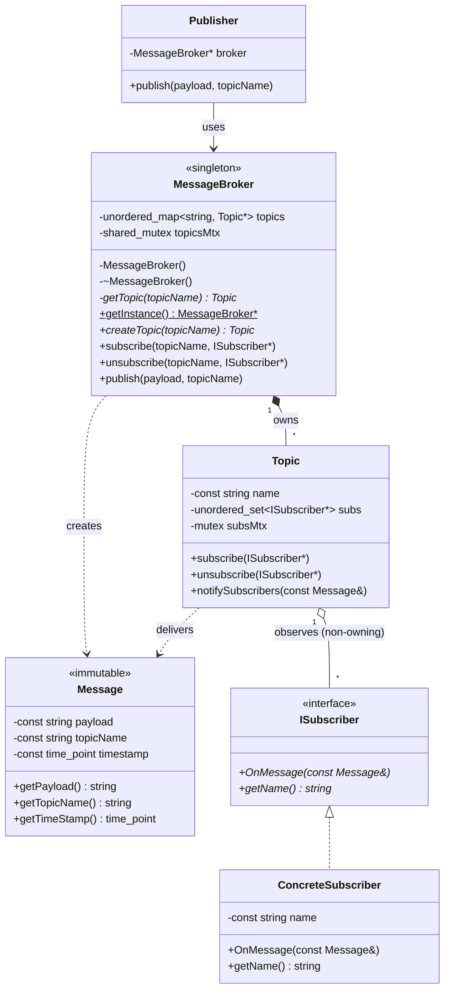

# Pub-Sub System — LLD / Machine Coding Round

**Level:** SDE-2 · **Language:** C++17 · **Date:** 14 Aug 2026
**Verdict:** 7.5 / 10

---

## 1. Problem Statement

Design an in-memory publish-subscribe system.

**Functional requirements**

- Create a topic
- Subscribe / unsubscribe to a topic
- Publish a message to a topic
- Multiple subscribers per topic
- Multiple topics

**Non-functional requirements**

- Publishers must not know about consumers, and vice versa
- Thread safety

---

## 2. Clarifying Questions and Agreed Semantics

The round opened by pinning down semantics before any code. This was the strongest part
of the interview — every answer was decisive and defensible.

| # | Question | Decision | Consequence |
|---|---|---|---|
| 1 | Push or pull? | **Push** — broker invokes `OnMessage` | No per-subscriber queues, no polling loop |
| 2 | Delivery guarantee | **At-most-once.** Try once; on failure, skip and continue | No acks, no retries, no dead-letter queue |
| 3 | Retention | **None.** Subscriber only sees messages published after it subscribed | No log, no offsets, no replay |
| 4 | Ordering | **No guarantee** across subscribers | Frees the design to use an unordered container |
| 5 | `publish` blocking? | **Blocking**, fully synchronous, on the caller's thread | Publisher latency = sum of all subscriber handler times |

The honest framing here: with these five answers this is a **synchronous in-process event
bus**, not a broker. That is a legitimate v1 and was accepted, but it must be owned
explicitly rather than discovered later.

---

## 3. Flow

```
Publisher
   │  publish(payload, topicName)
   ▼
MessageBroker  ──[ shared_lock topicsMtx ]──► resolve Topic*  ──[ unlock ]──►
   │  wraps payload into Message(payload, topicName, now())
   ▼
Topic  ──[ lock subsMtx ]──► copy subscriber set into vector ──[ unlock ]──►
   │
   ├─► S1.OnMessage(msg)      ← all of this runs OUTSIDE any lock,
   ├─► S2.OnMessage(msg)         on the publisher's thread
   └─► S3.OnMessage(msg)
```

Key property: **no lock is held while subscriber code runs.** Both the broker lock and
the topic lock are released before delivery begins.

---

## 4. Class Design



**File layout**

```
PubSubSystem/
├── MessageBroker.h
├── main.cpp
├── model/
│   ├── Message.h
│   ├── Publisher.h
│   └── Topic.h
└── subscriber/
    ├── ISubscriber.h
    └── ConcreteSubscriber.h
```

---

## 5. Concurrency Model — the core of the round

### 5.1 Two mutexes, two scopes

| Lock | Guards | Type | Held during delivery? |
|---|---|---|---|
| `MessageBroker::topicsMtx` | the `topicName → Topic*` map | `std::shared_mutex` | **No** — released the moment the `Topic*` is resolved |
| `Topic::subsMtx` | the subscriber set | `std::mutex` | **No** — released after the snapshot is copied |

`shared_mutex` is the right call for the topic registry: lookups (`publish`, `subscribe`,
`unsubscribe`) take a shared lock and run concurrently; only `createTopic` takes the
exclusive lock. Topic creation is rare, lookup is hot — textbook read-heavy workload.

### 5.2 The snapshot pattern

```cpp
void notifySubscribers(const Message& m){
    std::vector<ISubscriber*> subsSnapshot;
    {
        std::lock_guard<std::mutex> lock(subsMtx);
        for(auto it : subs) subsSnapshot.push_back(it);
    }                                     // ← lock released here
    for(auto it : subsSnapshot) it->OnMessage(m);
}
```

This is the single most important decision in the whole design, and it was reached
unprompted. It buys three things at once:

1. **No concurrent-modification hazard** — the set can be mutated freely during delivery.
2. **No convoy** — a slow `OnMessage` does not block `subscribe`/`unsubscribe` on that topic.
3. **Re-entrancy safety** — a subscriber whose handler calls `publish` on the *same* topic
   does not deadlock, because `std::mutex` is non-reentrant and would otherwise
   self-deadlock. This was verified experimentally (see §8, T2).

### 5.3 Guarantees the design actually offers

Stated plainly, because an API that doesn't state these is unusable:

- Unsubscribe is **not immediately effective**. A publish already in flight will still
  deliver to a subscriber that unsubscribed mid-delivery. This was called out explicitly
  during the design discussion — good.
- A subscriber may have `OnMessage` invoked **concurrently on multiple threads** (multiple
  publishers, same topic). **The subscriber is responsible for its own internal thread
  safety.** The broker guarantees nothing here. *This is not documented anywhere in the
  code and should be.*
- Delivery order across subscribers is unspecified (`unordered_set` iteration order).

### 5.4 Subscriber lifetime — the contested decision

The broker stores **non-owning raw `ISubscriber*`**. Position taken:

> "Subscriber lifetime is not to be handled by the topic or broker, as it is an
> independent service."

Three options were put on the table:

| Option | Cost |
|---|---|
| `shared_ptr` | Broker co-owns; subscribers outlive their intended death; unsubscribe becomes the only way to free them |
| `weak_ptr` | Broker observes without owning; `lock()` during snapshot, skip expired. Fully preserves the stated policy **and** is crash-safe |
| Raw pointer + contract | Zero overhead, but a use-after-free is reachable from correct-looking client code |

**Chosen: raw pointer + contract.** Defensible, and common in real event-bus code — but it
was chosen without stating the contract. `weak_ptr` was the strictly better answer here
because it delivers the same ownership policy *and* closes the hole; the fact that
at-most-once semantics already permit dropping a message means an expired subscriber can
simply be skipped, at no semantic cost.

Minimum acceptable version of the contract, which is currently missing from the code:

```cpp
class ISubscriber {
public:
    // CONTRACT: a subscriber MUST unsubscribe from every topic it is
    // registered with BEFORE it is destroyed. The broker holds non-owning
    // raw pointers and does not validate them. Violating this is UB.
    //
    // CONTRACT: OnMessage may be invoked concurrently from multiple
    // publisher threads. Implementations must be thread-safe.
    virtual ~ISubscriber() = default;
    virtual void OnMessage(const Message& m) = 0;
};
```

---

## 6. Design Decisions — Log

| Decision | Alternative | Why this one |
|---|---|---|
| Broker wraps payload into `Message` | Publisher constructs `Message` | Publisher deals in payload only; timestamp/topic stamping is the broker's job. Keeps the publisher ignorant of the transport type. **Nice touch.** |
| `subscribe`/`unsubscribe` on the **Broker**, not `Topic` | Hand out `Topic*` and let callers subscribe directly | Keeps `Topic` internal, so its lifetime and locking stay under broker control. *Corrected mid-interview after the initial UML exposed `Topic` — good recovery.* |
| `unordered_set<ISubscriber*>` | `list` / `vector` | O(1) subscribe, O(1) unsubscribe, free de-duplication. Only viable because ordering was explicitly waived — the decisions chain correctly. |
| `shared_mutex` on registry, plain `mutex` on subscriber set | One global mutex | Global mutex would serialise all topics; per-topic locking gives real parallelism across topics. |
| `Message` fully immutable, passed as `const Message&` | Pass by value / non-const ref | One allocation shared safely across all subscribers; subscriber 1 cannot mutate what subscriber 2 receives. Correct on both perf and safety. |
| Meyers singleton for the broker | Static instance + double-checked locking | Thread-safe initialisation guaranteed since C++11, no manual locking, correct destruction order. Copy ctor and assignment deleted. |
| Topics live for the broker's lifetime, no `deleteTopic` | Add `deleteTopic` | Makes the resolve-then-release pattern in `getTopic` safe: a resolved `Topic*` can never dangle because nothing frees topics early. **This is a real invariant, and it is load-bearing.** |

---

## 7. Mistakes and Gaps

Ordered by severity.

### 🔴 HIGH — No exception isolation in `notifySubscribers`

The agreed semantics were *"try once, if unable to do so skip and move to the next
subscriber."* The code does not implement this. A throwing `OnMessage` propagates out of
`notifySubscribers`, out of `MessageBroker::publish`, and into the publisher's stack —
aborting delivery to every subscriber not yet visited.

This was called out explicitly before coding began ("`try/catch` around each `OnMessage` so
one bad subscriber doesn't abort the loop") and still shipped missing. That makes it a
requirements miss, not an oversight.

Verified — see §8, T1: `*** EXCEPTION ESCAPED publish(): handler blew up`.

**Fix:**

```cpp
for(auto* sub : subsSnapshot){
    try {
        sub->OnMessage(m);
    } catch (const std::exception& e) {
        std::cerr << "[topic:" << name << "] subscriber threw: " << e.what()
                  << " — dropping message for this subscriber\n";
    } catch (...) {
        std::cerr << "[topic:" << name << "] subscriber threw unknown exception\n";
    }
}
```

### 🟠 MEDIUM — `createTopic` returns `Topic*`, leaking the internal handle

```cpp
Topic* createTopic(const std::string& topicName);   // current
```

The `subscribe`/`unsubscribe` API was correctly moved onto the broker so that `Topic` stays
encapsulated — and then `createTopic` hands the pointer straight back out. A caller can now
do `broker->createTopic("t")->subscribe(&s)`, bypassing the broker entirely, and can hold a
pointer whose lifetime rules are broker-internal. Half a fix.

**Fix:** `bool createTopic(const std::string& topicName);` — returns whether it was newly
created. `Topic` never escapes the broker.

### 🟠 MEDIUM — Owning raw pointers + manual `delete`

```cpp
std::unordered_map<std::string, Topic*> topics;
~MessageBroker(){ for(auto it : topics) delete it.second; }
```

This was flagged before coding and not taken. If `new Topic(...)` succeeds but the map
insert throws, the topic leaks. Manual `delete` in a destructor is also exactly the code
`unique_ptr` exists to remove.

**Fix:**

```cpp
std::unordered_map<std::string, std::unique_ptr<Topic>> topics;
// ~MessageBroker() = default;  — nothing to write
```

`getTopic` then returns `it->second.get()`, and the invariant "topics outlive every
resolved pointer" is unchanged.

### 🟠 MEDIUM — Errors reported via `std::cout`, APIs return `void`

`subscribe`, `unsubscribe` and `publish` all return `void` and print to `std::cout` on
failure — `"Unregistered topic"`, `"Already subscribed"`, `"Not subscribed"`. Two problems:

1. **The caller cannot detect failure.** Publishing to a non-existent topic is silently a
   no-op from the caller's perspective. In a real system that is a lost message with no signal.
2. **Library code should not own the process's stdout.** A broker that prints is unusable in
   any host that has its own logging.

**Fix:** return `bool` (or throw `UnknownTopicException` for the publish path, since a
publish to a topic that doesn't exist is a programming error, not a routine outcome).

### 🟡 LOW — `std::cout` is not synchronised across threads

Each `<<` is a separate unsynchronised operation. The concurrent section of `main` produces
interleaved output; it happened to look clean in this run, but that's luck. For a demo
whose whole purpose is showing that locking works, garbled output undermines the point.

**Fix:** a small `std::mutex coutMtx` guarding a `log()` helper in the demo code.

### 🟡 LOW — `ConcreteSubscriber::OnMessage` ignores its own `name`

```cpp
std::cout << "Payload received : " << payload << std::endl;
```

`getName()` exists on the interface and is never used, so the demo output cannot show
*which* subscriber received *what*. That is the one thing a pub-sub demo needs to
demonstrate. `"Payload received : India won the match"` twice proves nothing about routing.

**Fix:** `std::cout << "[" << name << "] <- " << m.getTopicName() << ": " << payload << "\n";`

Separately: `getName()` on `ISubscriber` is questionable interface design. Identity for
display is a subscriber's own concern; the broker never uses it. Either drop it from the
interface or justify it (e.g. for logging inside the broker).

### 🟡 LOW — Accessors return `const std::string` by value

```cpp
const std::string getPayload() const { return payload; }
```

Top-level `const` on a by-value return is meaningless, and this copies the string on every
call — once per subscriber per message. Should be `const std::string& getPayload() const`.
Safe here precisely because `Message` is immutable and outlives the `OnMessage` call.

### 🟡 LOW — `getInstance()` returns a pointer

Returning `MessageBroker&` is the idiomatic Meyers singleton. A pointer invites
`delete broker` (which would be UB on a static) and forces null checks that can never fire.

### ⚪ NIT

- `Topic(const std::string& name)` should be `explicit`.
- The snapshot loop can be `std::vector<ISubscriber*> snap(subs.begin(), subs.end());`.
- `Message` is constructed even when a topic has zero subscribers — irrelevant at this scale.

---

## 8. Verification

Compiled with GCC 11.4 and run under ThreadSanitizer.

```
$ g++ -std=c++17 -Wall -Wextra -pthread main.cpp -o pubsub
   → clean, zero warnings

$ g++ -std=c++17 -fsanitize=thread -g -pthread main.cpp && ./a.out
   → exit 0, ZERO ThreadSanitizer warnings
```

Three additional stress tests were written against the submitted headers:

| Test | Scenario | Result |
|---|---|---|
| **T1** | A throwing subscriber alongside a healthy one | ❌ **`*** EXCEPTION ESCAPED publish()`** — confirms the missing `try/catch` |
| **T2** | Subscriber calls `publish` on the *same* topic from inside `OnMessage` | ✅ Survived to depth 3, no deadlock — confirms the snapshot pattern is correct |
| **T3** | 4 publisher threads × 2000 publishes racing 8 threads × 2000 subscribe/unsubscribe cycles on one topic | ✅ Survived, **no TSAN warning in `Topic` or `MessageBroker`** |

> The single TSAN warning in T3 was a race on the *test harness's own* counter
> (`GoodSub::count++` incremented from multiple delivery threads) — not broker code. That
> is itself instructive: it is a live demonstration that **subscribers must be thread-safe
> themselves**, which the design does not currently document.

The concurrency implementation is correct. That is the hard part of this problem, and it
holds up under sanitizer pressure.

---

## 9. Follow-up Questions

**Q. `publish` is fully synchronous. What breaks at scale, and what changes?**
Publisher latency is the sum of all handler times, and one slow subscriber degrades every
publisher on that topic. The move is a per-subscriber inbox: each subscriber gets a bounded
queue plus a dedicated worker thread. `publish` then becomes an enqueue and returns
immediately. That change alone forces new decisions on queue-full policy (block, drop
oldest, drop newest) and on shutdown draining.

**Q. Once delivery is async, ordering changes. What can you still guarantee?**
With one worker per subscriber and a FIFO inbox, you keep per-topic-per-subscriber FIFO
ordering — which is usually the guarantee people actually want. You lose any cross-subscriber
ordering, which was already waived here.

**Q. How would you unit-test this given the singleton?**
This is the singleton's real cost. Options: extract an `IMessageBroker` interface and make
the singleton one construction path rather than the only one; or add a test-only `reset()`.
Cleanest is to make `MessageBroker` a normal class and have the singleton be a thin
`getInstance()` over it, so tests construct their own instance.

**Q. A subscriber calls `unsubscribe` from inside its own `OnMessage`. Safe?**
Yes, and only because of the snapshot. `subsMtx` is not held during delivery, so the
`unsubscribe` acquires it cleanly. The subscriber still receives the current message, per
the stated guarantee.

**Q. `deleteTopic` is added. What breaks?**
`getTopic` resolves a `Topic*` and releases `topicsMtx` before using it. Thread A holds that
pointer while thread B frees the topic — use-after-free. Fixes: switch to
`shared_ptr<Topic>` so the resolver holds a reference for the duration; or make deletion a
two-phase tombstone + deferred reclamation. The current design is safe *only* because topics
are immortal.

**Q. How would you add wildcard subscriptions (`sports.*`)?**
Replace the flat map with a prefix tree keyed on topic segments, and resolve a publish to
the set of matching nodes. The snapshot pattern generalises: collect the union of matching
subscriber sets under lock, deliver outside it.

---

## 10. Scorecard

### 🟢 Positives

- **Semantics pinned before design.** Every one of the five opening questions got a
  decisive, defensible answer. No hedging, no discovering requirements mid-code.
- **The snapshot-under-lock, deliver-outside-lock pattern was reached unprompted.** This is
  the crux of the problem and the thing that separates a working pub-sub from a deadlocking
  one. Getting it without hints is the strongest signal in this round.
- **Correct, TSAN-clean concurrency** under adversarial stress, including the re-entrant
  publish case.
- **Decisions chain coherently.** "Ordering doesn't matter" → `unordered_set` → free
  de-duplication. "Read-heavy registry" → `shared_mutex`. Nothing is cargo-culted.
- **Guarantees stated explicitly**, including the uncomfortable one ("unsubscribe is not
  immediately effective") rather than glossed over.
- **Good recovery under pushback.** The `Topic`-leaking API was spotted and fixed
  immediately; the `map` mutex gap was closed without defensiveness.
- **Clean structure** — sensible directories, header guards, `explicit` where it matters,
  immutable `Message`, `const&` on the hot path. Compiles warning-free under `-Wall -Wextra`.

### 🔴 Negatives

- **Shipped a requirement that was stated twice and agreed to.** The `try/catch` was in the
  agreed semantics *and* in the pre-coding instructions. Missing it means the delivered
  system does not implement its own spec. This is the single biggest deduction.
- **Three concrete improvement suggestions were acknowledged and none were applied**
  (`unique_ptr` for topics, `getInstance()` returning a reference, the subscriber-lifetime
  contract comment). Taking feedback into the code is part of the signal in a machine
  coding round.
- **Settled for the weaker option on subscriber lifetime.** `weak_ptr` gave the same
  ownership policy *and* closed a use-after-free at essentially zero semantic cost, given
  at-most-once. "Not my problem" is a valid stance, but it is the wrong trade when the
  alternative is free.
- **API is not usable by a caller** — `void` returns plus `std::cout` diagnostics mean
  failures are invisible to the code that needs to react to them.
- **The demo doesn't demonstrate.** Subscribers don't print their names, so the output can't
  show routing — which is the entire thing being tested.

### Rating: **7.5 / 10**

The hard part is right. The concurrency model is correct, deliberate, and survives
sanitizer stress — and it was arrived at through reasoning rather than recall. That alone
clears the SDE-2 bar for design.

What holds it back is follow-through: agreed-upon requirements and accepted feedback did not
make it into the code. At SDE-2 the expectation is not just "designs correctly" but "ships
what was agreed." A `try/catch`, a `unique_ptr`, and three `bool` return types — perhaps
fifteen lines total — would put this comfortably at 9.

**Hire signal: yes, for design and concurrency reasoning. Watch for: closing the loop
between what was agreed and what was written.**
